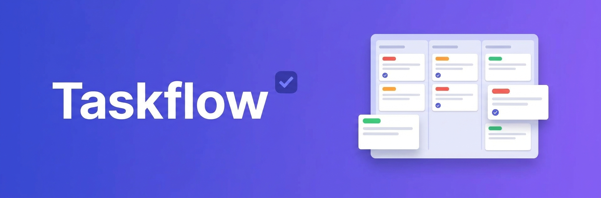

<p align="center">
  
</p>

<p align="center">
  <a href="https://github.com/johnpc/taskflow/actions/workflows/ci.yml"></a>
  
</p>

# Taskflow

**A fast, focused project & task manager for getting things done.** Plan work on a board, work
through it in a list, and always know what's next — projects, sections, tasks, subtasks, priorities,
due dates, and comments, in a clean app that works on the web, as an installable PWA, and natively on
iOS and Android.

> Create an account, and your workspace is private to you and synced across every device.

## Features

| Area               | What you get                                                                  | Status |
| ------------------ | ----------------------------------------------------------------------------- | ------ |
| **Home**           | Dashboard landing: greeting, due-today / overdue stats, what's coming up      | ✅     |
| **Projects**       | Create color-coded projects, favorite them, add a description, archive/delete | ✅     |
| **Templates**      | Start a ready-made project (Sprint / Content / Launch) with sections + tasks  | ✅     |
| **Counts**         | Open-task count badge per project; overdue count on My Tasks                  | ✅     |
| **Sections**       | Add, rename, delete, and reorder a project's columns/sections                 | ✅     |
| **Board**          | Kanban columns (To do / In progress / Done) with inline task creation         | ✅     |
| **List view**      | Board↔List toggle (persisted per project); collapsible sections, list-first   | ✅     |
| **Tasks**          | Title, notes, priority (Low→High), due dates with overdue/today/upcoming cues | ✅     |
| **Due presets**    | One-tap Today / Tomorrow / Next week due-date buttons                         | ✅     |
| **Drag & drop**    | Drag a card across columns to move it to another section                      | ✅     |
| **Reorder**        | Move a task up/down within its section                                        | ✅     |
| **Multi-select**   | Select tasks in the list view and bulk-complete or delete                     | ✅     |
| **Quick-edit**     | Set a due date and cycle priority straight from a card, no detail needed      | ✅     |
| **Inline rename**  | Rename a task in place from its card (pencil), no detail needed               | ✅     |
| **Subtasks**       | Break a task into a checklist with its own done-count                         | ✅     |
| **Dependencies**   | Mark a task "blocked by" others; a banner + board badge flag it until done    | ✅     |
| **Recurring**      | Repeat a task daily/weekly/monthly; completing it spawns the next occurrence  | ✅     |
| **Rich notes**     | Notes render **bold**, safe links, and [ ]/[x] checklists (XSS-guarded hrefs) | ✅     |
| **Comments**       | Discuss and log activity on any task                                          | ✅     |
| **Labels**         | Reusable colored tags; apply on task detail, chips render on every card       | ✅     |
| **Move & assign**  | Move a task between sections and assign it to yourself, on task detail        | ✅     |
| **Delete task**    | Delete a task (with confirm) from its detail; it leaves the board             | ✅     |
| **My Tasks**       | Everything open across projects — group by due date or priority, open total   | ✅     |
| **Calendar**       | Two-week forward view of upcoming dated tasks, grouped by day                 | ✅     |
| **Search**         | Live substring search across every task's title and notes                     | ✅     |
| **Complete**       | One-tap complete on the board and in lists, with a strike-through state       | ✅     |
| **Undo**           | An undo toast after completing a task — one tap to bring it back              | ✅     |
| **Completed view** | Per-project archive of done tasks (with when), each reopenable                | ✅     |
| **Activity**       | Created / completed relative timestamps on task detail                        | ✅     |
| **Filter & sort**  | Hide/show completed, filter by label, sort by due date or priority            | ✅     |
| **Dark mode**      | Follows your OS, with an in-app Light / Dark / System override                | ✅     |
| **Accounts**       | Email sign-up/sign-in; your workspace is private and owner-scoped             | ✅     |
| **Shortcuts**      | Keyboard nav — `g` then h/p/t/c to jump around, `/` to search, `?` for help   | ✅     |

## The vision

Most task managers are either too heavy (a project-management suite you fight with) or too light (a
notes app pretending). Taskflow aims for the middle: the **interaction fabric** of a great task
manager — a board you can think in, a list you can grind through, and a "what's due" view that tells
you where to point your attention — without the ceremony. It's guest-free on purpose: your work is
yours, private and synced.

## How it works

Taskflow is a **shell + feature-slice** app:

- **Client:** Ionic 8 + React 19 + TypeScript (strict) + Vite, wrapped by Capacitor for iOS/Android.
  Server state flows through react-query wrapping the AWS Amplify data client; UI state lives in
  hooks + context. Every screen renders four honest states — loading, error (retryable), empty, and
  ready — through one shared `LoadState`, so nothing ever hangs on a spinner.
- **Backend:** AWS Amplify Gen2 — Cognito auth + AppSync (GraphQL) + DynamoDB. The data model is
  `Project → Section → Task` (subtasks are tasks with a parent) `+ Comment + Label`.

### Where the data comes from

There's no AI generation or ingestion here — **you** are the source of the data. Everything you see is
your own workspace. Every model is **owner-scoped** (`allow.owner()`): a signed-in account only ever
reads and writes its own rows, enforced at the API layer by Cognito, not just in the UI. The board
you open, the tasks you complete, and the comments you post are stored in DynamoDB under your
identity and synced to every device you sign in on.

## Install

- **Web / PWA:** open the app in your browser and choose **Add to Home Screen** (or your browser's
  install button) for a full-screen, offline-ready app.
- **iOS:** TestFlight link coming once the first build is live.
- **Android:** a debug APK is published to each GitHub Release.

## Development

```bash
npm install
npm run dev            # Vite dev server (add -- --port 5178 if 5173 is busy)
npm run quality        # full gate: lint + format + line-length + feature-coverage + tests(80%) + CRAP(15) + build
npm run test:e2e       # Gherkin acceptance tests (TF_PORT=5178 locally to dodge a busy 5173)
npm run seed           # seed a demo workspace (needs .env.local creds)
```

The backend is AWS Amplify Gen2 — `npx ampx sandbox` stands up a personal cloud backend, and
`npm run e2e-config` pulls its config into `amplify_outputs.json` (git-ignored).

### Quality bar

Enforced by both a husky pre-commit hook and CI: no `any`, every logic file ≤ 100 lines, ≥ 80% test
coverage, CRAP ≤ 15 per function, Prettier-clean, a passing build, and a Gherkin acceptance scenario
for every user-facing flow (asserting on real seeded data). See [CLAUDE.md](./CLAUDE.md) for the full
architecture and conventions.

## License

MIT
